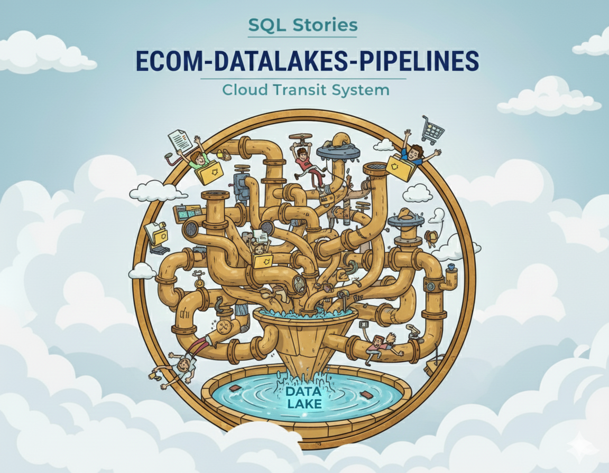

<p align="center">
  <sub>ecom-datalake-pipelines · Medallion lakehouse orchestration with dbt, DuckDB, and BigQuery</sub>
</p>
<p align="center">
  
  <br>
  <em>Bronze → Silver → Gold — Production-ready lakehouse transformation pipelines.</em>
</p>

<p align="center">
  
  
  
  
</p>

<p align="center">
  <a href="https://github.com/G-Schumacher44/ecom_datalake_pipelines/actions/workflows/pipeline-e2e.yml">
    
  </a>
  <a href="https://github.com/G-Schumacher44/ecom_datalake_pipelines/actions/workflows/python-quality.yml">
    
  </a>
  <a href="https://github.com/G-Schumacher44/ecom_datalake_pipelines/actions/workflows/dbt-validation.yml">
    
  </a>
  <a href="https://github.com/G-Schumacher44/ecom_datalake_pipelines/actions/workflows/docker-build.yml">
    
  </a>
</p>

---

# ecom-datalake-pipelines

A production-grade medallion lakehouse pipeline showcasing Bronze → Silver → Gold transformations for e-commerce analytics. Built with **dbt**, **DuckDB**, **BigQuery**, **Polars**, and **Airflow**, this project demonstrates modern data engineering patterns including data contracts, quality gates, schema evolution, and observability.

___

## 🧩 TLDR;

- **Bronze layer**: Raw Parquet ingestion from GCS with manifest validation and lineage metadata.
- **Base Silver (dbt-duckdb)**: Type-safe transformations, integrity checks, and deduplication using DuckDB.
- **Enriched Silver (Polars)**: Business-aligned tables with precomputed metrics, cohort analysis, and behavioral features built with pure Polars transforms.
- **Gold marts (dbt-bigquery)**: Aggregated analytics tables optimized for BI and reporting in BigQuery.
- **Orchestration**: Airflow DAGs coordinate Bronze → Silver → Gold flows with partition-level backfill and incremental processing.
- **Observability**: Audit trails, data quality metrics, and SLA monitoring baked into every transformation.
- **Spec-driven orchestration**: Layered YAML specs drive table lists, partitions, and gates (see [Spec Overview](docs/resources/SPEC_OVERVIEW.md)).

<details>
<summary> ⏯️ Quick Start</summary>

1. **Clone and set up environment**
   ```bash
   git clone https://github.com/YOUR_USERNAME/ecom-datalake-pipelines.git
   cd ecom-datalake-pipelines

   conda env create -f environment.yml
   conda activate ecom-datalake-pipelines
   pip install -e .
   pre-commit install
   ```

2. **Configure secrets and settings**
   ```bash
   cp .env.example .env
   # Edit .env with your GCS credentials and BigQuery project

   # Review pipeline config
   cat config/config.yml
   ```

3. **Pull sample Bronze data**
   ```bash
   # Profile your Bronze samples
   python scripts/describe_parquet_samples.py --date-range 2020-01-01..2020-02-29
   ```

4. **Run transformations locally**
   ```bash
   # Base Silver (DuckDB)
   cd dbt_duckdb
   dbt deps
   dbt build --target dev

   # Enriched Silver (Polars)
   python scripts/run_enriched_all_samples.py --base-path data/silver/base --output-path data/silver/enriched

   # Gold marts (BigQuery)
   cd dbt_bigquery
   dbt deps
   dbt build --target dev
   ```

5. **Spin up Airflow**
   ```bash
   make up
   # Navigate to http://localhost:8080
   # To stop: make down
   ```

</details>

<details>
<summary> 📦 Sample Data Included</summary>

The repository comes pre-loaded with **Bronze Parquet samples** in `samples/bronze/` to enable immediate testing without cloud dependencies.

- **Tables**: `orders`, `order_items`, `customers`, `products`, `shopping_carts`, `cart_items`, `returns`, `return_items`
- **Date Range**: Includes slices from **Oct 2025** (simulated)
- **Format**: Hive-partitioned Parquet with `_MANIFEST.json` files
- **Use Case**: Run full Bronze → Silver → Enriched transformations locally using DuckDB and Polars.

</details>

<details>
<summary> 🚀 Zero-Config Demo</summary>

Want to see it in action instantly? Run the full local pipeline (Bronze -> Silver -> Enriched) with a single command line:

```bash
# Process sample data from Bronze to Enriched Silver (no Docker required)
make local-silver && make local-dims && make local-enriched DATE=2025-10-15
```

</details>

---

## 📐 What's Included

- **Medallion architecture**: Bronze (raw) → Silver (clean, typed) → Gold (aggregated marts).
- **Spec-driven pipeline control**: Table lists, partitions, and validation gates live in `config/specs/*.yml`.
- **dbt-duckdb for Base Silver**: Leverage DuckDB's speed for local development and testing.
- **Polars for Enriched Silver**: Pure Python transforms for business logic, cohort analysis, and feature engineering.
- **dbt-bigquery for Gold marts**: SQL-based aggregations optimized for BI and reporting in BigQuery.
- **Data contracts**: Explicit Bronze → Silver type mapping and required field definitions.
- **Quality gates**: Primary key uniqueness, foreign key referential integrity, and non-negative numeric constraints.
- **Airflow orchestration**: DAGs for backfill, incremental processing, and partition-level recovery.
- **Observability**: Audit JSON emitted per table/partition, ready for SLA dashboards and alerting.
- **Dimension snapshot validation**: Lightweight quality gate for dimension snapshots (customers, products) ensuring schema and primary key integrity without expensive historical scans.
- **Self-documenting profiling**: Bronze profiling script auto-generates schema maps, data dictionaries, and quality reports from live data samples.

### 🧭 Orientation & Getting Started

<details><summary><strong>⚠️ Limitations & Constraints (Portfolio Scope)</strong></summary>
<br>

- **DuckDB single-writer**: Base Silver runs as a single dbt task to avoid file locks. In a warehouse-backed prod setup, split into per-model tasks for retries and observability.
- **GCS sync idempotency**: `gsutil rsync` is not atomic. For production, sync to a staging prefix and publish via manifest or versioned run folder.
- **Batch-only assumptions**: The pipeline expects static Bronze partitions per run. Streaming/async ingestion could introduce "ghost" FK misses unless you snapshot or pin partitions.

</details>

<details>
<summary><strong>🧠 Notes from the Dev Team</strong></summary>
<br>

This pipeline was built to showcase end-to-end lakehouse best practices for portfolio and professional use. The Bronze layer ingests partitioned Parquet from GCS with full lineage metadata. Base Silver transforms raw data into clean, type-safe tables using dbt-duckdb for fast local iteration. Enriched Silver layers on business logic—customer cohorts, product velocity, order attribution—using pure Polars transforms for performance and testability. Gold marts aggregate Silver into analytics-ready fact and dimension tables in BigQuery.

Everything is designed for modularity and reusability: swap out buckets, adjust partition keys, or replace transformation engines—no rewrites needed. Data contracts define expectations, quality gates enforce them, and audit trails ensure visibility into every transformation.

**Self-Documenting Profiling System**: The Bronze profiling script doesn't just analyze data—it auto-generates documentation artifacts. Point it at your Bronze samples and it produces a comprehensive quality report, schema drift detection, a JSON schema map for programmatic use, updates your data contract with observed types, and even generates a data dictionary with field descriptions. Run it once and get your entire Bronze layer documented with real stats—no manual spreadsheet work required.

</details>

<details><summary><strong>📚 Resource Hub - Technical Documentation</strong></summary>
<br>

### 🏗️ Architecture & Design

- **[Architecture Overview](docs/resources/ARCHITECTURE.md)** - Complete system architecture and data flow
- **[Spec-Driven Orchestration](docs/resources/SPEC_OVERVIEW.md)** - YAML-based pipeline configuration pattern
- **[Configuration Strategy](docs/resources/CONFIG_STRATEGY.md)** - Config hierarchy and environment management
- **[Transformation Summary](docs/resources/TRANSFORMATION_SUMMARY.md)** - Catalog of all transforms (Base, Enriched, Gold)

### 🔍 Quality & Validation

- **[Validation Guide](docs/resources/VALIDATION_GUIDE.md)** - Three-layer validation framework (Bronze, Silver, Enriched)
- **[SLA & Quality Gates](docs/resources/SLA_AND_QUALITY.md)** - Quality thresholds and acceptance criteria
- **[Audit Schema](docs/planning/AUDIT_SCHEMA.md)** - Audit trail and observability metadata
- **[Observability Strategy](docs/resources/OBSERVABILITY_STRATEGY.md)** - Metrics, logging, and monitoring patterns

### ⚙️ Operations & Deployment

- **[Deployment Guide](docs/resources/DEPLOYMENT_GUIDE.md)** - Production deployment patterns and best practices
- **[CLI Usage Guide](docs/resources/CLI_USAGE_GUIDE.md)** - Command-line interface and common workflows
- **[Runbook](docs/resources/RUNBOOK.md)** - Operational procedures and troubleshooting
- **[Performance Tuning](docs/resources/PERFORMANCE_TUNING.md)** - Optimization strategies and benchmarks
- **[BigQuery Migration Guide](docs/planning/BQ_MIGRATION.md)** - Migration from local to warehouse execution

### 📊 Data & Self-Documenting Profiling

> **Self-Documenting System**: Documents below are auto-generated by profiling scripts. Run once and get comprehensive Bronze layer documentation with real stats.

**Bronze Data Profiling** ([`scripts/describe_parquet_samples.py`](scripts/describe_parquet_samples.py)):
- **[Bronze Profile Report](docs/data/BRONZE_PROFILE_REPORT.md)** ⚡ Quality report with schema drift detection
- **[Bronze Schema Map](docs/data/BRONZE_SCHEMA_MAP.json)** ⚡ Programmatic schema definitions (JSON)
- **[Data Contract](docs/resources/DATA_CONTRACT.md)** ⚡ Bronze → Silver type mapping (auto-updated)
- **[Data Dictionary](docs/data/DATA_DICTIONARY.md)** ⚡ Field definitions and business glossary

**Bronze Storage Analytics** ([`scripts/report_bronze_sizes.sh`](scripts/report_bronze_sizes.sh)):
- **[Bronze Sizes Report](docs/data/BRONZE_SIZES.md)** ⚡ Bucket and per-table storage analysis

### 📜 Historical Planning Documents

> **Note**: These documents show the original planning and design process. For current implementation, see the sections above.

- **[Intent & Philosophy](docs/planning/INTENT.md)** ⭐ Original vision - Why "Rich Silver" matters
- **[Architectural Decisions](docs/planning/DECISIONS.md)** - Decision log with rationale and impact
- **[Silver Transformation Plan](docs/planning/SILVER_PLAN.md)** - Original transformation strategy
- **[Silver Framework](docs/planning/SILVER_FRAMEWORK.md)** - Initial framework design
- **[Enriched Silver Strategy](docs/planning/ENRICHED_SILVER_STRATEGY.md)** - Original enriched layer plan
- **[Architecture Summary](docs/planning/ARCHITECTURE_SUMMARY.md)** - Early architecture overview

</details>

<details>

<summary><strong>🗺️ About the Project Ecosystem</strong></summary>

This repository is part of a larger data engineering portfolio demonstrating end-to-end lakehouse capabilities:

* **[`ecom_sales_data_generator`](https://github.com/G-Schumacher44/ecom_sales_data_generator)** `(The Engine)`
  Generates realistic, relational e-commerce datasets with configurable volumes, seasonality, and messiness levels.
* **[`ecom-datalake-exten`](https://github.com/G-Schumacher44/ecom-datalake-exten)** `(The Lake Layer)`
  Converts generator CSV output to Parquet with Hive partitioning, lineage metadata, and GCS publishing.
* **[`ecom-datalake-pipelines`](https://github.com/YOUR_USERNAME/ecom-datalake-pipelines)** `(This Repo · The Transformation Layer)`
  Orchestrates Bronze → Silver → Gold transformations using dbt, DuckDB, BigQuery, and Airflow.
* **[`sql_stories_skills_builder`](https://github.com/G-Schumacher44/sql_stories_skills_builder)** `(Learning Lab)`
  Publishes story modules and exercises using these datasets for hands-on SQL and analytics practice.
* **[`sql_stories_portfolio_demo`](https://github.com/G-Schumacher44/sql_stories_portfolio_demo/tree/main)** `(The Showcase)`
  Curates case studies and analytics dashboards for professional portfolio storytelling.

</details>

<details>
<summary><strong>🫀 Version & Status</strong></summary>

### Current Status: Feature Complete

- ✅ Project scaffolding and config setup
- ✅ Bronze profiling and schema validation
- ✅ dbt-duckdb Base Silver models (8 tables + quarantine)
- ✅ Data contract and quality gate definitions
- ✅ Polars Enriched Silver transforms (10 domain runners)
- ✅ dbt-bigquery Gold mart aggregations (8 fact tables)
- ✅ Airflow DAG orchestration (2 DAGs with full Bronze→Gold flow)
- ✅ Structured observability (metrics, logging, audit trails)
- ✅ Three-layer validation framework (Bronze, Silver, Enriched)
- 🚧 SLA dashboards and alerting (future enhancement)

</details>

<details>
<summary><strong>💪 Future Enhancements</strong></summary>

- **Incremental materialization**: Optimize Silver transformations with incremental models and merge strategies.
- **Data quality dashboard**: Load audit records into BigQuery and build Looker/Metabase dashboards for SLA tracking.
- **Great Expectations integration**: Add data quality profiling and anomaly detection.
- **CI/CD for dbt**: Automated testing, schema validation, and deployment via GitHub Actions.
- **dbt docs hosting**: Publish dbt lineage graphs and data dictionary to GitHub Pages.
- **Cost optimization**: Partition pruning, clustering, and query optimization for BigQuery.
- **Per-model orchestration**: Replace the DuckDB single-task run with per-model dbt tasks when using BigQuery/Snowflake.
- **Atomic GCS publishes**: Add a staging + manifest publish step for GCS syncs.
- **Validation severity**: Introduce warn vs drop semantics in enriched data quality checks.
- **Workload Identity**: Document and optionally wire production-grade auth (GKE/Composer/Cloud Run).

</details>

<details>
<summary>⚙️ Project Structure</summary>

```
ecom-datalake-pipelines/
├── airflow/
│   ├── dags/                   # Airflow DAG definitions
│   ├── docker-compose.yml      # Local Airflow setup
│   └── config/                 # Airflow configuration
├── config/
│   ├── config.yml              # Pipeline settings (buckets, prefixes, targets)
├── dbt_duckdb/                 # Base Silver dbt project (DuckDB)
│   ├── models/
│   │   └── base_silver/        # Type-safe, integrity-checked Silver tables
│   ├── macros/                 # Custom dbt macros for validation
│   ├── tests/                  # dbt tests for quality gates
│   └── dbt_project.yml
├── dbt_bigquery/               # Gold dbt project (BigQuery)
│   ├── models/
│   │   └── gold/               # Aggregated analytics marts (SQL only)
│   └── dbt_project.yml
├── docs/
│   ├── img/
│   │   └── pipelines_banner.png
│   └── planning/               # Architecture docs, contracts, and planning artifacts
├── scripts/
│   ├── describe_parquet_samples.py  # Bronze profiling and quality checks
│   └── bootstrap_airflow.sh         # Airflow setup helper
├── src/
│   ├── transforms/             # Pure Polars enrichment logic
│   ├── runners/                # I/O wrappers and domain runners
│   ├── validation/             # Bronze, Silver, Enriched validation packages
│   ├── observability/          # Structured logging, metrics, audit trails
│   └── settings.py             # Pydantic config models
├── tests/                      # pytest suite for Python modules
├── environment.yml             # Conda environment
├── pyproject.toml              # Python package config
├── Makefile                    # Common tasks (test, lint, airflow)
└── README.md
```

</details>

---

## ▶️ Setup

### 🔩 Configuration Setup

Pipeline settings are controlled via YAML config and environment variables.

<details>
<summary><strong>Environment variables</strong></summary>

Copy `.env.example` to `.env` and populate with your credentials:

```bash
# GCS settings
GCS_RAW_BUCKET=acme-analytics-raw
GCS_SILVER_BUCKET=acme-analytics-silver
GCS_PREFIX=ecom/raw

# BigQuery settings
BQ_PROJECT=your-gcp-project
BQ_DATASET_SILVER=ecom_silver
BQ_DATASET_GOLD=ecom_gold

# Auth (local/dev defaults to ADC)
# gcloud auth application-default login
# Optional service account (prod-style)
USE_SA_AUTH=true
GOOGLE_APPLICATION_CREDENTIALS=/path/to/service-account.json
```

For Docker-based local/dev runs, make sure your ADC file is mounted into the
container (see `docker-compose.yml` for the default gcloud config mount).

</details>

<details>
<summary><strong>Pipeline config (config.yml)</strong></summary>

Configure partition keys, quality thresholds, and transformation rules:

```yaml
bronze:
  bucket: acme-analytics-raw
  prefix: ecom/raw
  partition_key: ingest_dt

silver:
  bucket: acme-analytics-silver
  prefix: ecom/silver
  partition_key: event_dt

quality_gates:
  allow_nulls_in_pk: false
  max_duplicate_pk_pct: 0.01
  min_row_count: 1
```

</details>

### 📦 Dev Setup

<details>
<summary><strong>Conda environment (recommended)</strong></summary>
<br>

```bash
conda env create -f environment.yml
conda activate ecom-datalake-pipelines
pip install -e .
pre-commit install
```

</details>

<details>
<summary><strong>Pure pip / virtualenv option</strong></summary>
<br>

```bash
python -m venv .venv
source .venv/bin/activate
pip install -e .
pre-commit install
```

</details>

___

### ▶️ Usage

<details>
<summary><strong>Profile Bronze samples (self-documenting)</strong></summary>
<br>

The profiling script auto-generates multiple documentation artifacts from live data:

```bash
# Basic profile: generates quality report with schema drift detection
python scripts/describe_parquet_samples.py --date-range 2020-01-01..2020-01-31

# Profile specific tables or months
python scripts/describe_parquet_samples.py --tables orders,customers --months 2020-01,2020-02

# Generate schema JSON map for programmatic use
python scripts/describe_parquet_samples.py \
  --date-range 2020-01-01..2020-12-31 \
  --schema-json docs/data/BRONZE_SCHEMA_MAP.json

# Auto-update data contract with observed Bronze → Silver type mappings
python scripts/describe_parquet_samples.py \
  --date-range 2020-01-01..2020-12-31 \
  --update-contract docs/resources/DATA_CONTRACT.md

# Generate data dictionary with field descriptions
python scripts/describe_parquet_samples.py \
  --date-range 2020-01-01..2020-12-31 \
  --data-dictionary docs/data/DATA_DICTIONARY.md \
  --update-contract docs/resources/DATA_CONTRACT.md
```

**Outputs**: Quality report (markdown), schema map (JSON), updated data contract, and data dictionary—all generated from real data, no manual editing required.

</details>

<details>
<summary><strong>Run transformations</strong></summary>
<br>

```bash
# Base Silver (DuckDB)
cd dbt_duckdb
dbt deps
dbt build --target dev --select base_silver.*

# Enriched Silver (Polars runners)
python scripts/run_enriched_all_samples.py \
  --base-path data/silver/base \
  --output-path data/silver/enriched

# Gold marts (BigQuery)
cd dbt_bigquery
dbt deps
dbt build --target dev --select gold.*

# Run dbt tests only
dbt test --target dev
```

</details>

<details>
<summary><strong>Run Airflow locally</strong></summary>
<br>

```bash
# Initialize and start Airflow services
make up

# Access Airflow UI
open http://localhost:8080
# Default credentials: airflow / airflow

# Stop Airflow
make down
```

</details>

<details>
<summary><strong>Run Python tests</strong></summary>
<br>

```bash
# Run all tests
make test

# Run specific test file
pytest tests/test_validation.py -v

# Run with coverage
pytest --cov=src tests/
```

</details>

___

## 🧪 Testing and Validation Guide

<details>
<summary>🎯 Test Objectives</summary>

- Validate Bronze profiling detects schema drift and data quality issues.
- Ensure Base Silver transformations enforce data contracts and quality gates.
- Verify Enriched Silver Polars transforms correctly compute business metrics and cohorts.
- Test Airflow DAGs for partition-level idempotency and backfill logic.

</details>

<details>
<summary>🛠️ Running the Tests</summary>

```bash
# Python unit tests
pytest tests/ -v

# dbt tests (Base Silver)
cd dbt_duckdb && dbt test --target dev

# dbt tests (Gold marts)
cd dbt_bigquery && dbt test --target dev

# Polars transform unit tests
pytest tests/test_transforms.py -v

# Pre-commit hooks (lint, format, type checks)
pre-commit run --all-files
```

</details>

___

## 🏗️ Architecture Overview

### Medallion Layers

```
┌─────────────────────────────────────────────────────────────────┐
│ BRONZE (Raw)                                                    │
│ • GCS Parquet (Hive partitioned by ingest_dt)                  │
│ • Lineage metadata: batch_id, event_id, ingestion_ts           │
│ • Manifest validation: row counts, checksums                   │
└─────────────────────────────────────────────────────────────────┘
                              ↓
┌─────────────────────────────────────────────────────────────────┐
│ BASE SILVER (dbt-duckdb)                                        │
│ • Type casting and normalization                                │
│ • Deduplication by primary key                                  │
│ • Foreign key validation                                        │
│ • Null handling and integrity checks                            │
│ • Partitioned by event_dt                                       │
└─────────────────────────────────────────────────────────────────┘
                              ↓
┌─────────────────────────────────────────────────────────────────┐
│ ENRICHED SILVER (Polars runners)                                │
│ • Customer cohorts and LTV segmentation                         │
│ • Product velocity and inventory metrics                        │
│ • Order attribution and channel analysis                        │
│ • Returns risk scoring                                          │
│ • Precomputed features for ML                                   │
│ • Written to GCS, then loaded into BigQuery                     │
└─────────────────────────────────────────────────────────────────┘
                              ↓
┌─────────────────────────────────────────────────────────────────┐
│ GOLD (dbt-bigquery)                                             │
│ • Aggregated fact tables (daily sales, returns)                 │
│ • Dimension tables (customers, products, dates)                 │
│ • BI-optimized views for Looker/Tableau                         │
│ • Incremental marts with SCD Type 2 support                     │
└─────────────────────────────────────────────────────────────────┘
```

### Technology Stack

- **Bronze ingestion**: GCS, Parquet, Hive partitioning, manifest validation
- **Base Silver**: dbt-duckdb (local dev and transformation)
- **Enriched Silver**: Polars (pure Python transforms), GCS (storage)
- **Gold marts**: dbt-bigquery (SQL aggregations in BigQuery)
- **Orchestration**: Apache Airflow (Docker), TaskGroups, dynamic DAGs
- **Observability**: Audit JSON, SLA dashboards, dbt test results
- **Testing**: pytest (Polars transforms), dbt tests (SQL models)

___

## 🤝 On Generative AI Use

Generative AI tools (Claude Sonnet 4.5, ChatGPT, Gemini) were used throughout this project as part of an integrated workflow—supporting code generation, documentation refinement, architecture design, and problem-solving. These tools accelerated development and improved quality, but the system design, logic, and documentation reflect intentional, human-led decisions. This repository demonstrates a collaborative process: where automation enhances productivity, and iteration deepens mastery.

---

## 📦 Licensing

This project is licensed under the [MIT License](LICENSE).

___

<p align="center">
  <a href="README.md">🏠 <b>Home</b></a>
  &nbsp;·&nbsp;
  <a href="docs/planning/SILVER_PLAN.md">🗺️ <b>Architecture</b></a>
  &nbsp;·&nbsp;
  <a href="docs/resources/DATA_CONTRACT.md">📋 <b>Data Contract</b></a>
  &nbsp;·&nbsp;
  <a href="docs/planning/TESTING_RUNBOOK.md">🧪 <b>Testing</b></a>
  &nbsp;·&nbsp;
  <a href="docs/data/BRONZE_PROFILE_REPORT.md">📊 <b>Bronze Profile</b></a>
  &nbsp;·&nbsp;
  <a href="docs/data/DATA_DICTIONARY.md">📖 <b>Data Dictionary</b></a>
</p>

<p align="center">
  <sub>✨ Transform the data. Tell the story. Build the future. ✨</sub>
</p>
