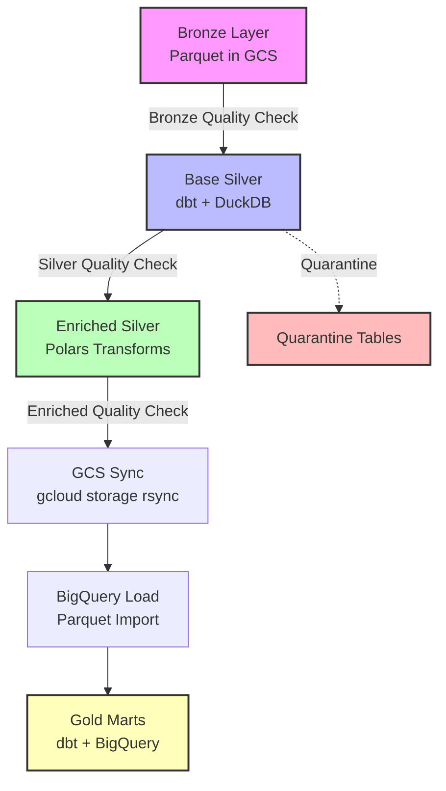

# Architecture Overview

## Data Flow Diagram



## Text Flow

```
Bronze (Parquet in GCS or local)
    ↓  [Bronze Quality Validation]
Base Silver (dbt + DuckDB)
    ↓  [Silver Quality Validation + Optional Profile]
Enriched Silver (Polars transforms)
    ↓  [Enriched Quality Validation]
    ↓  [Sync to GCS with gcloud storage rsync]
BigQuery Load (Parquet import)
    ↓
Gold Marts (dbt + BigQuery)
```

## Key Layers

- **Bronze**: Raw, partitioned parquet files with lineage metadata
- **Base Silver**: Cleaned/typed tables and quarantine outputs (dbt + DuckDB)
- **Enriched Silver**: Derived features/aggregations using **Polars Lazy API** for optimized query plans and memory efficiency
- **Gold**: Business-facing marts (dbt + BigQuery)

## Configuration & Gating

- **Centralized Config**: All SLAs, table partitions, and semantic checks are managed in `config/config.yml`
- **Quality Gates**:
    - **Bronze**: Pre-compute checks for manifests and empty partitions
    - **Silver**: Post-compute checks for pass rates and SLAs
    - **Enriched**: Schema validation, key uniqueness, semantic constraints
    - **Gating**: Strict enforcement (`--enforce-quality`) ensures the pipeline stops immediately on failure in Production

## Error Recovery & Retry Strategy

### Airflow DAG Configuration

- **Default retries**: 1 retry per task
- **Retry delay**: Immediate (0 seconds) - suitable for transient GCS/network issues
- **Exponential backoff**: Not enabled by default (portfolio scope)

### Recommended Production Settings

```python
default_args = {
    "retries": 3,
    "retry_delay": timedelta(minutes=5),
    "retry_exponential_backoff": True,
    "max_retry_delay": timedelta(hours=1),
}
```

### Task-Level Recovery

- **dbt tasks**: Built-in idempotency via table materialization
- **Polars transforms**: Deterministic, safe to re-run
- **GCS sync**: `gcloud storage rsync` with `--delete-unmatched-destination-objects` ensures atomic state
- **BigQuery loads**: `WRITE_TRUNCATE` disposition for partition-level idempotency

### Failure Handling

- **Validation failures**: Pipeline halts in strict mode (`--enforce-quality`)
- **Transform failures**: Logged to structured error logs with full traceback
- **Quarantined data**: Isolated to quarantine tables, does not block downstream processing
